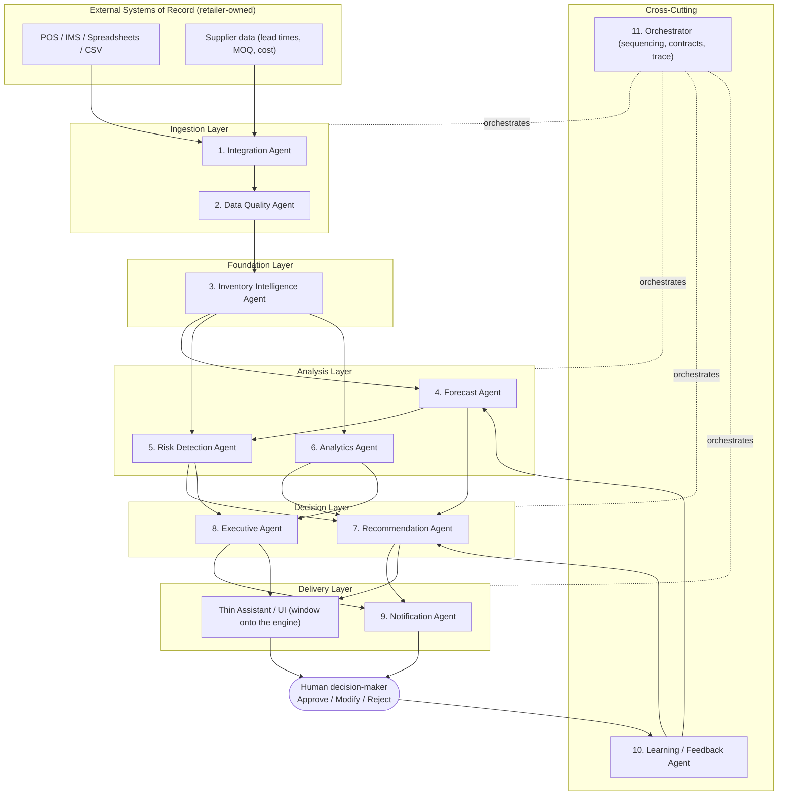
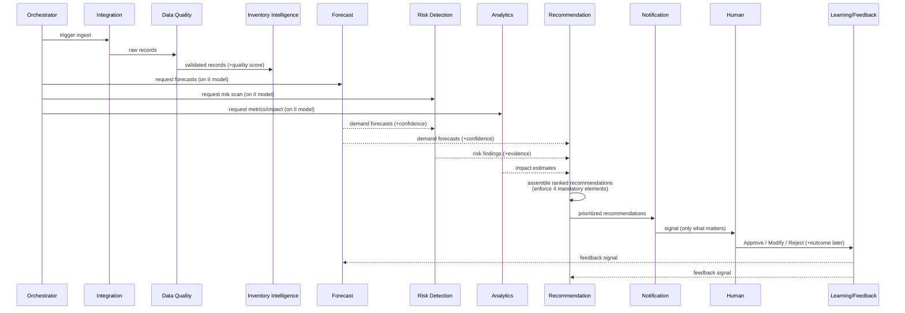

# 13 — Agent Architecture

> **Purpose.** Define an enterprise-grade, multi-agent architecture for the StockSense
> Decision Intelligence Engine. This document establishes the agents, their
> responsibilities, how they communicate, and the diagrams that describe the system. It
> critically evaluates the suggested agent set and improves it.
>
> **Scope note.** This is the **logical** architecture blueprint: it specifies the agents,
> their responsibilities, and their contracts. As of the Phase 0 → Phase 1 boundary, the
> multi-agent design and orchestration approach are **finalized** in
> [ADR-0005](adr/0005-multi-agent-orchestration.md) and
> [ADR-0010](adr/0010-multi-agent-architecture-rationale.md), and the implementation
> technology stack is **frozen** in [ADR-0009](adr/0009-technology-stack.md). This document
> is deliberately kept technology-agnostic at the logical level — concrete tooling lives in
> ADR-0009 — but where a runtime choice is now settled it is annotated inline rather than
> left open.

---

## 1. Design Goals & Constraints

The architecture is derived directly from the [Product Principles](../product/10-product-principles.md)
and [AI Philosophy](../product/12-ai-philosophy.md):

1. **Explainability is structural.** No recommendation leaves the system without reasoning,
   confidence, supporting data, and business impact. This is enforced at an agent boundary,
   not left to convention.
2. **Human-in-the-loop.** The system produces proposals; humans decide. No default
   autonomous execution.
3. **Separation of concerns.** Each agent owns one cohesive responsibility, enabling
   independent evolution, testing, and observability.
4. **Traceability.** Every output is traceable to its inputs across the full agent chain.
5. **Graceful degradation.** Data-quality and confidence problems propagate honestly
   rather than being masked.
6. **Layered, not rip-and-replace.** The Integration boundary isolates external systems of
   record so the core engine is source-agnostic.

---

## 2. Critical Evaluation of the Suggested Agent Set

The brief suggested eight agents: Integration, Inventory Intelligence, Forecast, Risk
Detection, Recommendation, Analytics, Executive, and Notification. This set is a strong
foundation, but a critical review reveals **three structural gaps** that would undermine
the product's core promises if left unaddressed.

| Concern with the base set | Consequence if unaddressed | Resolution |
| --- | --- | --- |
| **No explicit data-quality guardian.** Shrink and admin errors corrupt the very data decisions rely on (see [Market Research](../research/04-market-research.md)). | The system would confidently recommend actions on bad data — violating "never recommend without evidence." | **Add a Data Quality Agent** upstream of analysis. |
| **No coordination/orchestration layer.** Eight peer agents with implicit ordering become fragile and untraceable. | Race conditions, unclear provenance, no single audit trail. | **Add an Orchestrator** to sequence work and own end-to-end traceability. |
| **No learning loop.** The workflow requires that human overrides improve the system, but no agent owns that. | The feedback loop in [Business Workflow](../business/09-business-workflow.md) would not exist. | **Add a Learning / Feedback Agent.** |

Additionally, the **Executive** and **Analytics** agents overlap. We keep both but sharpen
their boundary: **Analytics** computes metrics and diagnostics (the "what/why" in data);
**Executive** synthesizes cross-store, role-appropriate summaries for owners/ops (the "so
what" at the top). See §4 for the delineation.

**Conclusion:** the suggested eight are *necessary but not sufficient*. We adopt them and
add three (**Data Quality**, **Orchestrator**, **Learning/Feedback**) for an **11-agent**
architecture. Each addition is justified above and traceable to a stated principle.

---

## 3. The StockSense Agent Roster (11 Agents)

| # | Agent | One-line responsibility | Layer |
| --- | --- | --- | --- |
| 1 | **Integration Agent** | Connect to and ingest data from external systems of record | Ingestion |
| 2 | **Data Quality Agent** *(added)* | Validate, clean, reconcile, and score data trustworthiness | Ingestion |
| 3 | **Inventory Intelligence Agent** | Build the normalized, current inventory state model | Foundation |
| 4 | **Forecast Agent** | Predict future demand with confidence intervals | Analysis |
| 5 | **Risk Detection Agent** | Detect stockout, overstock/dead-stock, anomaly, expiry risks | Analysis |
| 6 | **Analytics Agent** | Compute metrics, diagnostics, and quantify business impact | Analysis |
| 7 | **Recommendation Agent** | Convert findings into ranked, explained, confidence-scored actions | Decision |
| 8 | **Executive Agent** | Synthesize role-appropriate, cross-store executive summaries | Decision |
| 9 | **Notification Agent** | Deliver the right signal to the right person at the right time | Delivery |
| 10 | **Learning / Feedback Agent** *(added)* | Capture decisions/outcomes and improve future outputs | Cross-cutting |
| 11 | **Orchestrator** *(added)* | Sequence agents, enforce contracts, own end-to-end traceability | Cross-cutting |

Full per-agent contracts (inputs, outputs, guarantees) are in the
[Agent Catalog](../agents/agent-catalog.md).

---

## 4. Layered System Architecture



### Layer responsibilities

- **Ingestion:** isolate and sanitize the outside world. Nothing downstream trusts raw
  external data; it trusts *validated* data with a quality score.
- **Foundation:** a single, normalized, source-agnostic model of inventory truth.
- **Analysis:** turn the truth model into forecasts, detected risks, and quantified impact.
- **Decision:** turn analysis into ranked, explained actions and executive synthesis.
- **Delivery:** get the right output to the right human without creating noise.
- **Cross-cutting:** orchestration + learning span all layers.

---

## 5. Communication Model

### 5.1 Principles
- **Event/pipeline-oriented, orchestrated.** The Orchestrator sequences the pipeline and
  can run analysis agents in parallel where inputs allow (Forecast, Risk, Analytics all
  consume the Foundation model). The orchestration runtime is **finalized** as an explicit
  stateful graph (LangGraph) over reliable asynchronous messaging (RabbitMQ) per
  [ADR-0009](adr/0009-technology-stack.md), with the rationale in
  [ADR-0010](adr/0010-multi-agent-architecture-rationale.md).
- **Contract-first messaging.** Agents communicate via explicit, versioned message
  contracts (schemas), not shared mutable state. This keeps agents independently testable
  and evolvable.
- **Provenance on every message.** Each message carries a trace ID and references to the
  upstream evidence that produced it, enabling end-to-end explanation.
- **Confidence and quality travel with the data.** A data-quality score (from the Data
  Quality Agent) and forecast confidence (from the Forecast Agent) are first-class fields
  that downstream agents must respect.

### 5.2 Canonical message envelope (conceptual)

```
Message {
  trace_id            // ties the whole decision chain together
  producer_agent
  timestamp
  payload             // the domain object (forecast, risk finding, recommendation, ...)
  evidence_refs[]     // pointers to upstream inputs/data used
  confidence          // where applicable (0..1, calibrated)
  data_quality_score  // trustworthiness of underlying data
}
```

This envelope is what makes the four mandatory recommendation elements *structurally*
guaranteed: by the time a message reaches the Recommendation Agent, reasoning
(`evidence_refs`), confidence, and supporting data are already attached; the agent adds
business impact and refuses to emit anything missing a field.

### 5.3 End-to-end sequence



---

## 6. Agent Responsibility Summary

Concise here; full contracts in the [Agent Catalog](../agents/agent-catalog.md).

1. **Integration Agent** — Connectors to POS/IMS/CSV/supplier data; ingestion scheduling;
   mapping external schemas to the internal model. *Isolates the outside world.*
2. **Data Quality Agent** — Detect missing/duplicate/contradictory records, reconcile
   discrepancies (e.g., shrink signals), and attach a trustworthiness score. *Guards the
   "evidence" promise.*
3. **Inventory Intelligence Agent** — Maintain the normalized current-state model: catalog,
   stock levels, categories, perishability, supplier attributes. *Single source of truth.*
4. **Forecast Agent** — Per-SKU demand forecasts with seasonality/trend and calibrated
   confidence intervals. *Answers "what will happen."*
5. **Risk Detection Agent** — Predict stockouts, overstock/dead stock, anomalies,
   expiry/obsolescence, using forecasts + current state + lead times. *Finds problems
   early.*
6. **Analytics Agent** — Compute inventory KPIs and diagnostics; quantify business impact
   (revenue at risk, capital trapped) used for ranking. *Answers "why / how much."*
7. **Recommendation Agent** — Convert findings into specific, ranked actions; enforce the
   four mandatory elements; refuse incomplete outputs. *Answers "what to do." The contract
   enforcement point.*
8. **Executive Agent** — Roll up risks, actions, and impact into role-appropriate,
   cross-store summaries. *Answers "so what" for owners/ops.*
9. **Notification Agent** — Route the right output to the right person via the right
   channel; enforce signal-over-noise suppression. *Protects attention and trust.*
10. **Learning / Feedback Agent** — Capture approve/modify/reject decisions and realized
    outcomes; feed them back to improve forecasts and recommendations. *Closes the loop.*
11. **Orchestrator** — Sequence the pipeline, parallelize where safe, enforce message
    contracts, and own the end-to-end trace. *The conductor and auditor.*

---

## 7. Cross-Cutting Concerns (non-agent, system-wide)

These are architectural requirements every agent inherits (quantified in the
[Non-Functional Requirements](non-functional-requirements.md) and governed by the ADRs
referenced below):

- **Explainability enforcement:** contract validation at the Recommendation/Executive
  boundary rejects outputs missing mandatory elements ([ADR-0004](adr/0004-explainable-ai-mandate.md)).
- **Governance:** all AI outputs are bound by the platform-wide governance controls in
  [ADR-0007](adr/0007-ai-governance-framework.md).
- **Observability:** each agent emits health, latency, and quality telemetry; the
  Orchestrator aggregates a decision-level trace (targets in
  [Non-Functional Requirements](non-functional-requirements.md)).
- **Confidence calibration monitoring:** the Learning Agent monitors whether stated
  confidence matches realized outcomes ([ADR-0007 §3](adr/0007-ai-governance-framework.md#3-confidence-score-methodology)).
- **Security & tenancy:** retailer data is isolated per tenant with least-privilege,
  read-oriented access to external systems of record, per
  [ADR-0008](adr/0008-security-architecture.md).
- **Extensibility:** new connectors (Integration) and new risk types (Risk Detection) are
  additive and do not require changes to downstream contracts.

---

## 8. How the Architecture Upholds Each Product Promise

| Product promise | Architectural mechanism |
| --- | --- |
| "Always explain" | Message envelope carries evidence; Recommendation Agent enforces 4 elements |
| "Always show confidence" | `confidence` is a first-class, calibrated field; Learning Agent monitors it |
| "Never recommend without evidence" | Data Quality gate + `evidence_refs` requirement |
| "Prioritize business impact" | Analytics Agent quantifies impact; Recommendation ranks by it |
| "Signal over noise" | Notification Agent suppression logic |
| "Human in control" | Human decision node is terminal; no default autonomous execution |
| "Layered, not replace" | Integration Agent isolates external systems of record |
| "Learn from feedback" | Learning/Feedback Agent closes the loop |
| "Traceable, no black boxes" | Orchestrator owns end-to-end trace IDs and provenance |

---

## 9. Resolved Decisions & Remaining Open Questions

Several questions that were open at initial authoring have since been **resolved** by later
ADRs. They are recorded here (rather than deleted) to preserve historical context and to
keep this document consistent with ADR-0008, ADR-0009, and ADR-0010.

**Resolved**

1. **Runtime coordination style** — *Resolved.* Finalized as an explicit orchestrated
   stateful graph (LangGraph) over reliable asynchronous messaging (RabbitMQ), per
   [ADR-0009](adr/0009-technology-stack.md); the multi-agent + orchestration rationale is in
   [ADR-0010](adr/0010-multi-agent-architecture-rationale.md) (originating decision:
   [ADR-0005](adr/0005-multi-agent-orchestration.md)). Kafka is the documented high-volume
   scale path.
2. **Deployment model** — *Resolved (default set).* Multi-tenant SaaS with per-tenant
   isolation enforced at the data layer (PostgreSQL row-level security), per
   [ADR-0008](adr/0008-security-architecture.md) and [ADR-0009](adr/0009-technology-stack.md).
   Exact topology and sizing are confirmed at Phase 1 kickoff.

**Remaining open (Phase 1 design detail)**

3. **Forecasting method selection strategy** (statistical baselines vs. ML, per data
   density, including cold-start) — bounded by the explainability constraint in
   [ADR-0004](adr/0004-explainable-ai-mandate.md); the concrete selection/cold-start policy
   is a Phase 1 design task.
4. **Real-time vs. scheduled batch analysis cadence** per retailer size — governed by the
   latency and freshness targets in the
   [Non-Functional Requirements](non-functional-requirements.md).

None of these block Phase 0; the resolved items are now consistent with the finalized ADRs,
and the remaining items are scoped as Phase 1 design detail.
