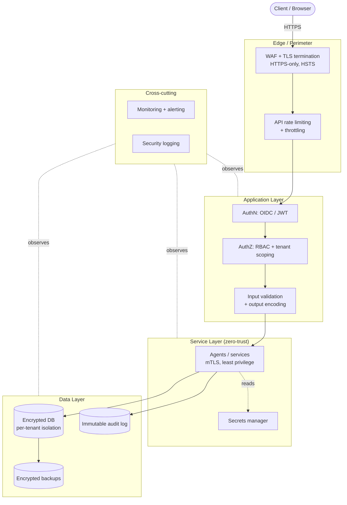
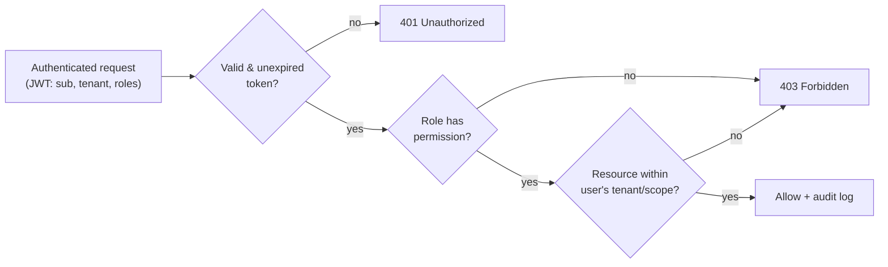

# ADR-0008 — Security Architecture

- **Status:** Accepted
- **Date:** Phase 0
- **Deciders:** Security & Privacy, Architecture, Product, AI

## Context

StockSense is a multi-tenant decision layer that reads a retailer's most commercially
sensitive data — sales history, stock positions, supplier terms, costs, and margins — and
returns money-affecting recommendations ([ADR-0006](0006-layer-over-systems-of-record.md)).
A breach would expose competitive data across tenants, corrupt the very data that decisions
depend on, and destroy the trust that is our entire adoption gate
([Personas](../../product/08-user-personas.md)). Because [ADR-0007](0007-ai-governance-framework.md)
already commits us to immutable audit logs, tenant isolation, least privilege, encryption,
and data minimization, we need a **single security architecture** that defines these
standards concretely *before implementation begins*, rather than discovering them
per-service during Phase 1.

Two forces make this urgent now:

1. **Security cannot be bolted on.** Authentication, isolation, encryption, and validation
   decisions shape data models, APIs, and deployment. Retrofitting them is expensive and
   error-prone.
2. **The threat surface is real from day one.** A layer that holds many retailers' data is a
   high-value target; commodity attacks (credential stuffing, injection, XSS, CSRF) will be
   attempted regardless of our size.

This ADR establishes the baseline. It is normative for Phase 1: services that do not meet it
are not shipped.

## Decision

Adopt a **defense-in-depth security architecture** built on the principles of **least
privilege, secure-by-default, zero-trust between services, and tenant isolation everywhere.**
The following standards are mandatory across the platform.

### Security layers (overview)



### 1. Authentication strategy

- **Standard protocol.** Use **OpenID Connect / OAuth 2.0** as the authentication
  foundation; support federated identity (SSO) so retailers can bring their own identity
  provider where available.
- **MFA.** Multi-factor authentication is required for privileged roles (Owner, Operations
  Manager, and any admin) and available to all users.
- **Short-lived access, refresh-based renewal.** Authenticated sessions issue short-lived
  access tokens (JWT, control 3) with server-side refresh (control 3).
- **No credentials in the client beyond tokens.** The browser/app holds only tokens, never
  long-lived secrets.
- **Machine-to-machine.** Agents and services authenticate to each other with
  workload identities and **mTLS** (control 9/12), never shared static API keys.

### 2. Role-Based Access Control (RBAC)

- **Roles map to personas** ([Personas](../../product/08-user-personas.md)): Owner,
  Operations Manager, Store Manager, Inventory Manager, plus internal Admin and read-only
  Auditor roles.
- **Tenant scoping is mandatory on every request.** Authorization is evaluated as
  `(role permissions) ∩ (tenant boundary) ∩ (resource scope, e.g., store)`. A user can never
  see data outside their tenant, and store-scoped users cannot see other stores.
- **Least privilege / deny-by-default.** Absence of an explicit grant is a denial. New
  endpoints are inaccessible until permissions are declared.
- **Separation of duties.** Governance-sensitive actions (e.g., enabling opt-in assisted
  execution per [ADR-0003](0003-human-in-the-loop-decisioning.md), or accessing audit logs)
  require elevated roles distinct from day-to-day use.



### 3. JWT lifecycle

- **Access tokens are short-lived** (minutes-scale, e.g., ~15 minutes) and carry only
  minimal claims: subject, tenant, roles/scopes, issuer, audience, issued-at, expiry, and a
  unique token id (`jti`).
- **Refresh tokens are longer-lived, rotating, and revocable**, stored/handled securely
  (e.g., httpOnly, Secure cookies for browser clients); each use rotates the refresh token
  and detects reuse (theft signal → revoke the family).
- **Signing.** Tokens are signed with asymmetric keys (e.g., RS256/ES256); signing keys are
  managed in the secrets manager (control 5) and **rotated** on a schedule, with published
  JWKS for verification.
- **Validation.** Every service validates signature, `exp`, `nbf`, `iss`, and `aud` on every
  request and rejects `alg=none` and algorithm-confusion attempts.
- **Revocation.** Support immediate revocation via short access-token TTL plus a
  refresh-token/`jti` denylist for logout, role changes, and suspected compromise.

```mermaid
sequenceDiagram
    participant C as Client
    participant A as Auth Service
    participant R as Resource API
    C->>A: Authenticate (credentials + MFA)
    A-->>C: access JWT (~15m) + refresh (rotating, httpOnly)
    C->>R: Request + access JWT
    R->>R: Verify signature, exp, iss, aud, tenant scope
    R-->>C: 200 (or 401/403)
    Note over C,A: On access-token expiry
    C->>A: Refresh (rotating refresh token)
    A->>A: Validate + rotate; detect reuse
    A-->>C: new access + new refresh
    Note over A: Logout / role change / compromise → revoke jti + refresh family
```

### 4. Password security

- **Prefer not to store passwords at all** where SSO/OIDC federation is used.
- Where local credentials exist: hash with a **memory-hard algorithm (Argon2id preferred;
  bcrypt/scrypt acceptable)** with per-user salt and tuned cost; never store plaintext or
  reversible encryption.
- **Strength & breach checks.** Enforce modern length-based policies and screen against
  known-breached password lists; avoid forced periodic rotation without cause.
- **Anti-automation.** Rate-limit and lock out on repeated failures (control 10); use
  constant-time comparisons; do not reveal whether an account exists.
- **Secure reset.** Password reset uses single-use, time-boxed, unguessable tokens delivered
  out-of-band.

### 5. Secrets management

- **Centralized secrets manager / vault** for all credentials, signing keys, DB passwords,
  and third-party connector tokens ([ADR-0006](0006-layer-over-systems-of-record.md)).
- **No secrets in source, images, logs, or client bundles.** CI enforces secret scanning;
  builds fail on detected secrets.
- **Dynamic, least-privilege, rotated.** Prefer short-lived, automatically rotated
  credentials scoped to a single workload; static long-lived secrets are the exception and
  are rotated on a schedule and on suspected exposure.
- **Encrypted at rest, access-audited.** Secret access is logged (control 16).

### 6. HTTPS enforcement

- **HTTPS everywhere; HTTP is refused or redirected.** TLS 1.2+ (prefer 1.3), strong cipher
  suites only.
- **HSTS** with a long max-age (and preload where appropriate); secure cookies flagged
  `Secure`, `HttpOnly`, and `SameSite`.
- **Internal traffic is encrypted too** (see controls 9 and 12) — no plaintext even inside
  the perimeter.

### 7. Encryption at rest

- **All persistent stores encrypted at rest** (databases, object storage, backups, audit
  logs) using strong symmetric encryption (e.g., AES-256).
- **Managed keys with rotation.** Use a managed KMS; keys are rotated and access-controlled;
  consider envelope encryption for large datasets.
- **Field-level encryption** for the most sensitive fields where warranted, above the
  storage-level default.
- **Backups inherit encryption** (control 18).

### 8. Encryption in transit

- **Every network hop is encrypted:** client↔edge (HTTPS/TLS, control 6) and
  service↔service (mTLS, control 12).
- **Connector traffic** to external systems of record is TLS-only; certificates validated,
  no downgrade.
- **No plaintext data on the wire, ever**, including internal analytics and log shipping.

### 9. Database security

- **Per-tenant isolation** enforced in the data model and query layer (row-level scoping
  and/or schema/database separation), so a query cannot cross tenants even if application
  logic errs.
- **Least-privilege DB accounts** per service; no shared superuser; separate read vs. write
  roles; the AI/analytics path is read-oriented where possible.
- **Parameterized access only** (control 12); no dynamic string-built SQL.
- **Encrypted at rest** (control 7) and **in transit** (control 8); network-restricted so the
  DB is not publicly reachable.
- **Change control & auditing** on schema and privileged data access (control 16).

### 10. API rate limiting

- **Rate limiting and throttling at the edge and per-identity** (per user, per tenant, per
  IP) to blunt brute-force, credential stuffing, scraping, and denial-of-service.
- **Sensitive endpoints** (auth, password reset, token refresh) get stricter limits and
  progressive backoff/lockout.
- **Quotas per tenant** protect noisy-neighbor scenarios in the multi-tenant layer.
- **Standard 429 responses** with `Retry-After`; limit breaches are logged and can alert
  (control 17).

### 11. Input validation

- **Validate everything, everywhere, server-side.** Treat all input (request bodies, query
  params, headers, uploaded CSVs from the Integration Agent, and assistant-interface text)
  as untrusted.
- **Allowlist / schema validation.** Enforce types, ranges, lengths, and formats via schemas;
  reject rather than sanitize-and-hope where possible.
- **Canonicalize then validate** to defeat encoding tricks; enforce size limits to prevent
  resource exhaustion.
- **Untrusted external content** (data from systems of record, AI-fetched content) is never
  executed and is quarantined per governance ([ADR-0007](0007-ai-governance-framework.md)).

### 12. SQL Injection prevention

- **Parameterized queries / prepared statements or a vetted ORM everywhere** — never
  string-concatenated SQL.
- **Least-privilege DB accounts** (control 9) cap the blast radius of any residual flaw.
- **Input validation** (control 11) is a secondary layer, not the primary defense.
- **Static analysis** in CI flags unsafe query construction.

### 13. XSS prevention

- **Context-aware output encoding** for all rendered data; treat inventory names, notes, and
  AI-generated narratives as untrusted at render time.
- **Content Security Policy (CSP)** to constrain script sources; avoid inline scripts and
  `eval`.
- **Framework auto-escaping** left enabled; sanitize any rich text with a vetted library.
- **Cookies** `HttpOnly` so token theft via XSS is mitigated (control 3/6).

### 14. CSRF protection

- **Anti-CSRF tokens** (synchronizer or double-submit) for state-changing, cookie-authenticated
  requests, **and/or** `SameSite` cookies.
- **Prefer `Authorization: Bearer` tokens** for APIs (not ambient cookies), which sidesteps
  classic CSRF for those paths.
- **Validate `Origin`/`Referer`** on sensitive state-changing endpoints as defense in depth.

### 15. OWASP Top 10 considerations

The controls above are explicitly mapped to the OWASP Top 10 risk categories:

| OWASP risk (category) | Primary mitigations in this ADR |
| --- | --- |
| Broken access control | RBAC + mandatory tenant scoping, deny-by-default (2, 9) |
| Cryptographic failures | TLS everywhere, encryption at rest/in transit, KMS (6, 7, 8) |
| Injection (SQLi, etc.) | Parameterized queries, validation, least-privilege DB (11, 12) |
| Insecure design | Defense-in-depth, threat modeling in the security roadmap (20) |
| Security misconfiguration | Secure-by-default, hardened configs, secret scanning (5, 6) |
| Vulnerable/outdated components | Dependency scanning + patching cadence (roadmap, 17) |
| Identification & auth failures | OIDC, MFA, secure JWT lifecycle, password hashing (1, 3, 4) |
| Software & data integrity failures | Signed artifacts, model/prompt versioning ([ADR-0007](0007-ai-governance-framework.md)) |
| Logging & monitoring failures | Immutable audit + security logging + alerting (16, 17) |
| Server-side request forgery (SSRF) | Egress controls, allowlists on connectors/fetch (11, roadmap) |

OWASP ASVS-style requirements and periodic testing are adopted in the security roadmap
(control 20).

### 16. Audit logging

- **Reuse and extend the governance audit log** from [ADR-0007](0007-ai-governance-framework.md):
  immutable, append-only, tamper-evident, tenant-scoped, and access-controlled.
- **Security events additionally captured:** authentication (success/failure), MFA events,
  token issuance/refresh/revocation, authorization denials, RBAC/role changes, secret access,
  privileged data access, config changes, and rate-limit breaches.
- **Integrity & privacy.** Logs record *who/what/when/where* with correlation IDs but avoid
  storing secrets or unnecessary PII (data minimization, control 19).
- **Retention** per the data-retention policy (control 19); logs support incident forensics.

### 17. Monitoring

- **Security monitoring and alerting** on anomalous authentication, privilege escalation,
  spikes in 401/403/429, unusual data-access volume (possible exfiltration), and connector
  errors.
- **Observability integration.** Security signals join the platform observability described
  in the [Agent Architecture](../13-agent-architecture.md) (health, latency, quality
  telemetry) so security and reliability are seen together.
- **Actionable alerts** route to on-call with runbooks; alert thresholds are tuned to avoid
  fatigue, mirroring the product's "signal over noise" ethos.
- **Continuous scanning** (dependencies, images, IaC) feeds the vulnerability-management
  cadence.

### 18. Backup strategy

- **Regular, automated, encrypted backups** of databases and audit logs (encryption per
  control 7).
- **3-2-1 principle:** multiple copies, more than one medium/location, at least one
  off-site/off-account isolated copy resistant to ransomware and accidental deletion.
- **Tenant-aware & restorable.** Backups preserve tenant isolation and support granular
  restore.
- **Tested restores.** Backups are verified and restore-tested on a schedule — an untested
  backup is treated as no backup.

### 19. Privacy & data protection alignment

- Inherits [ADR-0007](0007-ai-governance-framework.md): **data minimization** (avoid ingesting
  end-customer PII), **tenant isolation** end-to-end, **least privilege**, defined
  **retention & deletion** (including honored deletion requests), and encryption at rest/in
  transit.
- Access to sensitive data and audit logs is role-restricted (control 2) and logged
  (control 16).

### 20. Disaster recovery

- **Defined RPO/RTO targets** per data class (finalized in Phase 1); backups (control 18) and
  DR procedures are sized to meet them.
- **Documented, tested runbooks** for restore, region/provider failover, and
  secret/key-compromise rotation; DR drills are run periodically.
- **Graceful degradation.** Consistent with the AI fallback stance, if a dependency is
  unavailable the platform fails safe (read-only or clearly-degraded) rather than producing
  unsafe outputs.
- **Business continuity.** Communication and escalation plans accompany technical recovery.

## Rationale

- **Trust is the product's foundation.** Our target retailers hand over competitively
  sensitive data; a single cross-tenant leak or injection breach would be existential
  ([Value Proposition](../../product/03-value-proposition.md)).
- **A multi-tenant, data-rich layer is a high-value target**, so commodity and targeted
  attacks are inevitable; defense-in-depth and least privilege bound the blast radius of any
  single failure.
- **Security decisions are architectural.** Deciding authentication, isolation, encryption,
  and validation now prevents costly, risky retrofits during Phase 1.
- **It reinforces existing commitments.** This ADR operationalizes the security promises
  already made in [ADR-0007](0007-ai-governance-framework.md) and depends on the
  read-oriented, isolated boundary of [ADR-0006](0006-layer-over-systems-of-record.md).

## Trade-offs

- **Engineering and operational overhead.** MFA, mTLS, secrets rotation, tenant scoping on
  every query, encryption, and audit logging add build cost, latency, and ops burden.
- **Some user friction.** MFA and strict session lifecycles are marginally less convenient —
  an accepted cost for protecting financial data.
- **Cost.** KMS, secrets management, backups, off-site copies, and monitoring carry recurring
  spend.
- **Velocity friction.** Secure-by-default and security gates in CI slow "quick" changes,
  deliberately.
- **We standardize before we implement**, accepting that some specifics (exact TTLs, RPO/RTO,
  provider choices) are set in Phase 1; the *standards*, not the vendors, are fixed here.

## Alternatives Considered

1. **Defer security to Phase 1 / add later.** Rejected: security is architectural and
   retrofitting isolation, encryption, and authz is expensive and breach-prone; it also
   contradicts the promises in [ADR-0007](0007-ai-governance-framework.md).
2. **Roll our own authentication and token scheme.** Rejected: bespoke auth/crypto is a
   classic source of critical vulnerabilities; adopt vetted standards (OIDC/OAuth2, standard
   JWT, Argon2id).
3. **Rely on a perimeter firewall/WAF alone.** Rejected: single-layer perimeter security
   fails against internal movement, injection, and stolen credentials; defense-in-depth and
   zero-trust are required.
4. **Shared schema without enforced tenant isolation, guarded only by app code.** Rejected:
   one logic bug becomes a cross-tenant breach; isolation must be enforced at the data layer.
5. **Long-lived access tokens for simplicity.** Rejected: long TTLs make theft catastrophic;
   short-lived access + rotating refresh + revocation is the standard.

## Consequences

- **Security is a first-class, cross-cutting concern** in the
  [Agent Architecture](../13-agent-architecture.md): every service inherits authN/Z, tenant
  scoping, mTLS, validation, and audit obligations.
- **New security metrics and monitors** join platform observability and the governance
  metrics from [ADR-0007](0007-ai-governance-framework.md): auth failure/lockout rates,
  authz-denial rates, rate-limit breaches, secret-access anomalies, backup/restore success,
  and DR-drill outcomes.
- **CI/CD gains security gates** (secret scanning, dependency/image/IaC scanning, unsafe-SQL
  static analysis); builds fail on violations.
- **The data model must carry tenant scoping from the outset**, influencing Phase 1 schema
  design and the query layer.
- **Concrete parameters remain open Phase 1 decisions** (token TTLs, RPO/RTO targets, KMS and
  identity-provider selection, deployment/tenancy model), but must conform to these standards.
- This ADR **complements and does not supersede** ADRs
  [0003](0003-human-in-the-loop-decisioning.md), [0006](0006-layer-over-systems-of-record.md),
  and [0007](0007-ai-governance-framework.md).

## Security Roadmap

Aligned with the [Product Roadmap](../../planning/14-product-roadmap.md):

- **V1 (secure foundation).** OIDC/OAuth2 auth with MFA for privileged roles; RBAC with
  mandatory tenant scoping; short-lived JWT + rotating revocable refresh; Argon2id password
  hashing (where local creds exist); centralized secrets management; HTTPS-only + HSTS;
  encryption at rest and in transit; parameterized DB access with least-privilege accounts;
  server-side input validation; output encoding + CSP; CSRF defenses; edge rate limiting;
  core security audit logging; automated encrypted backups with tested restore; CI secret
  and dependency scanning.
- **V2 (harden & operationalize).** mTLS/zero-trust between all services; automated
  secret/key rotation; security monitoring dashboards and anomaly alerting; field-level
  encryption for the most sensitive fields; formal threat modeling and OWASP ASVS conformance;
  documented and drilled disaster-recovery runbooks with agreed RPO/RTO; regular vulnerability
  scanning and patch SLAs; periodic penetration testing.
- **V3 (assurance & scale).** Independent security assessment / audit readiness; alignment
  with recognized frameworks (e.g., SOC 2 / ISO 27001-style controls) as customer needs
  dictate; advanced anomaly/exfiltration detection; security controls required to unlock
  opt-in assisted execution ([ADR-0003](0003-human-in-the-loop-decisioning.md)); continuous
  compliance and enterprise-grade audit exports.
