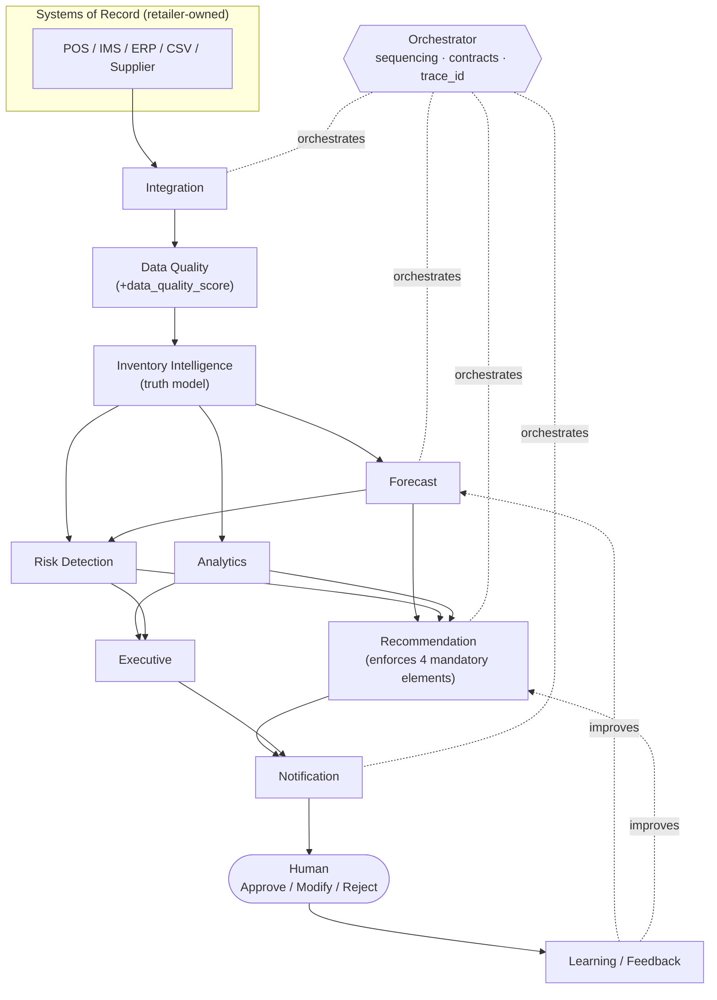
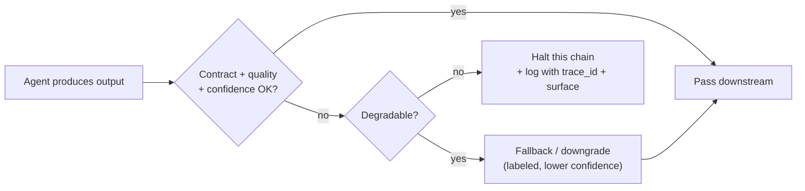
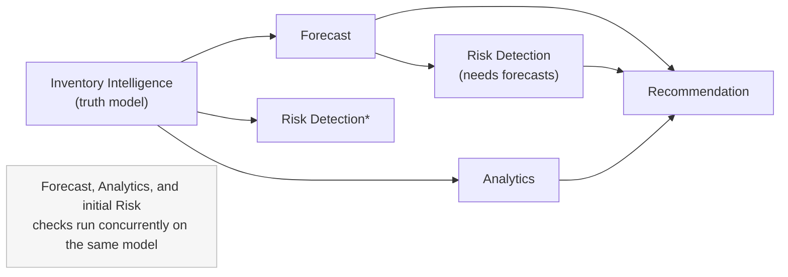

# ADR-0010 — Multi-Agent Architecture Rationale

- **Status:** Accepted
- **Date:** Phase 0 → Phase 1 boundary
- **Deciders:** Architecture, AI, Engineering

> **Relationship to prior ADRs.** [ADR-0005](0005-multi-agent-orchestration.md) *recorded the
> decision* to adopt an 11-agent architecture with an Orchestrator. This ADR provides the
> **deeper rationale** — specifically *why a multi-agent design instead of a single
> monolithic LLM system* — and the orchestration, failure, scalability, and evolution model
> behind it. It complements [ADR-0005](0005-multi-agent-orchestration.md) and
> [ADR-0009 (Technology Stack)](0009-technology-stack.md); it supersedes neither.
>
> **Numbering note.** This is ADR-0010 because ADR-0009 is already assigned to the
> Technology Stack decision. The topic requested ("ADR-0009: Multi-Agent Architecture
> Rationale") is captured here without disturbing the existing log.

## Problem Statement

StockSense must turn a retailer's raw data into **predicted risks, explanations, and
ranked, confidence-scored recommendations** — and it must do so in a way that is
**explainable, governed, traceable, and trustworthy** ([ADR-0004](0004-explainable-ai-mandate.md),
[ADR-0007](0007-ai-governance-framework.md)). The naive approach is a single, large
"do-everything" LLM: feed it the data and prompt it to produce recommendations.

That monolithic approach fails the product's core requirements in concrete ways:

1. **Numbers must be correct, not plausible.** Forecasts, reorder quantities, and impact
   figures require deterministic statistical/ML computation. An LLM asked to *generate*
   these will produce plausible-sounding but unverifiable numbers — a hallucination risk we
   treat as a top-severity defect ([RSK-05](../../business/risk-register.md)).
2. **Every output must be traceable to evidence.** A single opaque model gives no
   inspectable chain from raw data → conclusion, violating "no black boxes."
3. **Concerns are genuinely different.** Ingesting a POS feed, validating data quality,
   forecasting demand, detecting risk, and drafting an explained recommendation are distinct
   problems needing distinct techniques, tests, and failure modes.
4. **Trust requires containment.** A mistake in one area (e.g., a bad forecast) must not
   silently corrupt everything; it must be isolated, scored, and surfaced.

The problem, then, is not "how do we call an LLM," but **how do we architect a system that
produces trustworthy inventory decisions from messy data, with evidence and confidence, at
scale, without a black box.**

## Architectural Goals

The architecture is designed to satisfy, by construction:

1. **Correctness of numbers** — statistical/ML computation is separated from language
   generation.
2. **Explainability & traceability** — evidence and reasoning accrue along an inspectable
   pipeline ([ADR-0004](0004-explainable-ai-mandate.md)).
3. **Separation of concerns** — each capability is independently built, tested, evolved, and
   observed.
4. **Failure containment & graceful degradation** — a fault in one stage does not poison the
   whole decision.
5. **Scalability & parallelism** — independent workloads scale and run concurrently.
6. **Extensibility** — new data sources and risk types are additive, not invasive.
7. **Governance enforceability** — a single boundary can *validate* that outputs meet the
   mandatory-element contract ([ADR-0007](0007-ai-governance-framework.md)).

## Why Multiple Agents Instead of One LLM

A side-by-side of the two approaches against the goals:

| Requirement | Single monolithic LLM | Multi-agent architecture |
| --- | --- | --- |
| Numeric correctness | LLM free-generates numbers → unverifiable | Deterministic Forecast/Analytics agents compute; LLM only narrates |
| Explainability / evidence | Opaque; reasoning is post-hoc rationalization | Evidence (`evidence_refs`) attached at each stage; structural |
| Traceability | None end-to-end | `trace_id` across every hop (Orchestrator) |
| Data-quality guardrail | Bad data silently trusted | Dedicated Data Quality Agent gates and scores inputs |
| Testing | Hard to unit-test a giant prompt | Each agent independently testable |
| Failure isolation | One error corrupts the whole answer | Faults contained to a stage and surfaced |
| Confidence calibration | A single blended "vibe" score | Confidence composed from typed, measurable contributors |
| Extensibility | Re-prompt/retrain the monolith | Add a connector or risk type without touching downstream |
| Cost control | Large context every call | Right-sized: cheap deterministic work, LLM used sparingly |

**Core insight:** the LLM is *one capable component*, not the system. It excels at language —
explaining, summarizing, structuring — and is used exactly there. The parts that must be
**correct and verifiable** (validation, forecasting, risk math, impact) are handled by
deterministic agents. Multi-agent design lets each concern use the right tool, and lets the
system *prove* its outputs rather than merely assert them. This is the architectural
expression of the [AI Philosophy](../../product/12-ai-philosophy.md): augment human decisions
with grounded, explained, confidence-scored evidence — never a black-box oracle.

## Agent Responsibilities

Eleven agents across five layers plus two cross-cutting agents (full contracts in the
[Agent Catalog](../../agents/agent-catalog.md); system view in the
[Agent Architecture](../13-agent-architecture.md)):

| Agent | Responsibility (one line) | Layer |
| --- | --- | --- |
| Integration | Ingest data from external systems of record | Ingestion |
| Data Quality | Validate, reconcile, and score data trustworthiness | Ingestion |
| Inventory Intelligence | Maintain the normalized inventory truth model | Foundation |
| Forecast | Predict demand with calibrated confidence | Analysis |
| Risk Detection | Detect stockout / overstock / anomaly / expiry risks | Analysis |
| Analytics | Compute KPIs and quantify business impact | Analysis |
| Recommendation | Produce ranked, explained, confidence-scored actions | Decision |
| Executive | Synthesize role-appropriate cross-store summaries | Decision |
| Notification | Deliver the right signal to the right person | Delivery |
| Learning / Feedback | Capture decisions/outcomes; improve future outputs | Cross-cutting |
| Orchestrator | Sequence, parallelize, enforce contracts, own the trace | Cross-cutting |

Each agent owns *one cohesive responsibility*, which is precisely what makes independent
testing, scaling, and evolution possible.

### Agent interaction diagram



## Agent Communication Model

Agents do **not** share mutable global state. They communicate through **explicit,
versioned message contracts** wrapped in a shared envelope
([Agent Architecture §5.2](../13-agent-architecture.md#52-canonical-message-envelope-conceptual)):

```
Message {
  trace_id            // ties the whole decision chain together
  producer_agent
  timestamp
  payload             // forecast | risk finding | recommendation | ...
  evidence_refs[]     // pointers to upstream inputs/data used
  confidence          // calibrated, where applicable
  data_quality_score  // trustworthiness of underlying data
}
```

Properties that this model guarantees:

- **Provenance travels with data.** `evidence_refs` and `trace_id` make explanation and
  traceability structural, not reconstructed.
- **Quality and confidence are first-class.** A poor `data_quality_score` can only *weaken*
  downstream confidence, never inflate it.
- **Contracts, not coupling.** Because agents exchange typed messages (not shared memory),
  any agent can be re-implemented, scaled, or replaced without breaking others.
- **Enforceable governance.** By the time a message reaches the Recommendation Agent,
  reasoning (evidence), confidence, and data are already attached; the agent *validates* the
  four mandatory elements and rejects anything incomplete ([ADR-0004](0004-explainable-ai-mandate.md)).

## Orchestration Strategy

The **Orchestrator** is the conductor and auditor. It does not do domain work; it sequences
it, parallelizes where safe, enforces contracts, and owns the end-to-end trace.

- **Deterministic sequencing** of dependent stages: ingest → quality → truth model →
  analysis → decision → delivery.
- **Parallel fan-out** where inputs allow: Forecast, Risk Detection, and Analytics all
  consume the same Foundation model and run concurrently.
- **Contract enforcement** at each hop; a message failing its schema/quality gate does not
  proceed.
- **Trace ownership**: assigns and propagates `trace_id`, producing a complete provenance
  trail for any recommendation ([ADR-0007 §10](0007-ai-governance-framework.md#10-recommendation-traceability)).

```mermaid
sequenceDiagram
    participant OR as Orchestrator
    participant IA as Integration
    participant DQ as Data Quality
    participant II as Inventory Intelligence
    participant FC as Forecast
    participant RD as Risk Detection
    participant AN as Analytics
    participant RC as Recommendation
    participant NT as Notification
    participant H as Human
    participant LF as Learning/Feedback

    OR->>IA: trigger ingest (trace_id)
    IA->>DQ: raw records
    DQ->>II: validated records (+quality score)
    par Parallel analysis on the truth model
        OR->>FC: request forecasts
        OR->>RD: request risk scan
        OR->>AN: request metrics + impact
    end
    FC-->>RD: forecasts (+confidence)
    FC-->>RC: forecasts (+confidence)
    RD-->>RC: risk findings (+evidence)
    AN-->>RC: impact estimates
    RC->>RC: assemble ranked recs;<br/>validate 4 mandatory elements
    RC->>NT: prioritized recommendations
    NT->>H: signal (only what matters)
    H->>LF: Approve / Modify / Reject (+outcome later)
    LF-->>FC: feedback signal
    LF-->>RC: feedback signal
```

Implementation note: orchestration uses **LangGraph** (explicit stateful graph) plus
**RabbitMQ** for asynchronous, reliable inter-agent messaging, per
[ADR-0009](0009-technology-stack.md).

## Failure Handling

Failure containment is a primary reason for the architecture. Faults are isolated per agent
and surfaced, never silently propagated.

| Failure | Contained behavior |
| --- | --- |
| **Integration outage** | Continue on last-known-good data **flagged as stale**; alert ([RSK-02](../../business/risk-register.md)) |
| **Poor/invalid data** | Data Quality Agent quarantines and lowers `data_quality_score`; downstream confidence drops or output is withheld |
| **Low-confidence forecast** | Fall back to a simpler defensible method; lower confidence honestly |
| **Missing mandatory element** | Recommendation Agent withholds or downgrades to a labeled informational note — never emits a partial recommendation |
| **Upstream agent failure** | Orchestrator halts *that* decision chain and reports it with the `trace_id`; does not emit downstream outputs built on a failed step |
| **LLM/provider error** | Provider abstraction retries/falls back; deterministic numbers are unaffected because they never came from the LLM |



The guiding rule mirrors the [AI Philosophy](../../product/12-ai-philosophy.md): **silence
or honest degradation is acceptable; confident error is not.**

## Scalability

- **Independent horizontal scaling.** Each agent is a stateless service scaled to its own
  load profile — e.g., Integration scales with feed volume, Forecast with SKU count, LLM-
  backed narration with recommendation volume.
- **Right-sized compute.** Cheap deterministic agents handle the bulk of work; the expensive
  LLM is invoked narrowly, controlling cost ([OPS-08](../../business/11-success-metrics.md)).
- **Data-layer scaling** via PostgreSQL replicas/partitioning and TimescaleDB
  ([ADR-0009](0009-technology-stack.md)); messaging via RabbitMQ (Kafka as the high-volume
  path).
- **Per-tenant isolation** is preserved at every layer ([ADR-0008](0008-security-architecture.md)),
  so scaling one tenant never risks another.

## Parallel Execution

The pipeline is intentionally shaped so the analysis stage parallelizes:



- **Forecast, Analytics, and data-only Risk checks** run concurrently once the Foundation
  model is ready.
- **Cross-SKU / cross-store parallelism**: forecasting and risk detection are naturally
  partitioned by SKU/store and processed in parallel batches.
- The Orchestrator joins parallel results before the Recommendation stage, which needs all of
  them. A monolithic LLM cannot exploit this parallelism — it is a single sequential
  inference.

## Extensibility

- **New data source** → add an Integration connector; downstream contracts unchanged
  ([ADR-0006](0006-layer-over-systems-of-record.md)).
- **New risk type** (e.g., promotion cannibalization) → extend the Risk Detection Agent; the
  message contract already carries typed findings.
- **New recommendation action** → extend the Recommendation Agent's action set; the mandatory
  four-element contract still applies.
- **New model/provider** → swap behind the LLM/embedding abstraction
  ([ADR-0009](0009-technology-stack.md)); versioned and reversible
  ([ADR-0007 §9](0007-ai-governance-framework.md#9-model-version-tracking)).

Extensibility is *additive* precisely because responsibilities and contracts are separated —
the opposite of re-prompting or retraining a monolith for every change.

## Performance Implications

- **Latency:** more hops add coordination overhead vs. a single call, but parallel analysis
  and cheap deterministic stages keep end-to-end latency competitive; the expensive LLM step
  is bounded and often cacheable.
- **Throughput:** far higher than a monolith — independent, parallel, horizontally-scaled
  agents versus one large sequential inference.
- **Cost/performance:** deterministic computation is orders of magnitude cheaper than LLM
  tokens; using the LLM only for language keeps unit economics viable at retail SKU volumes.
- **Predictability:** deterministic agents have stable, testable performance; only the LLM
  step has variable latency, and it is isolated and instrumented (ENG-02/04,
  [Success Metrics](../../business/11-success-metrics.md)).

## Trade-offs

- **Operational complexity.** Many services, contracts, and an Orchestrator to run — more
  than a single app. Mitigated by managed infra, IaC, and observability
  ([ADR-0009](0009-technology-stack.md)).
- **Coordination overhead & latency** per decision vs. a single call — accepted for
  correctness, traceability, and containment.
- **Contract-first discipline.** Versioned message schemas add upfront design effort; the
  payoff is independent evolvability and testability.
- **Distributed-systems concerns** (ordering, retries, partial failure) must be handled —
  addressed by the Orchestrator, idempotent messaging, and per-stage failure containment.

## Alternatives Considered

1. **Single monolithic LLM ("prompt-and-pray").** Rejected: cannot guarantee numeric
   correctness, explainability, traceability, or failure containment; a black box that
   contradicts [ADR-0004](0004-explainable-ai-mandate.md)/[ADR-0007](0007-ai-governance-framework.md).
2. **LLM + tools (function calling) as a single agent.** Better than pure monolith, but a
   single agent conflates all concerns, is hard to test/observe per capability, and provides
   weak failure isolation and parallelism. Rejected as the *system* design (though individual
   agents may use tool-calling internally).
3. **Pure pipeline of services with no orchestrator (choreography).** Rejected for now:
   implicit ordering harms traceability and makes end-to-end provenance and failure handling
   fragile; an explicit Orchestrator owns the trace ([ADR-0005](0005-multi-agent-orchestration.md)).
4. **The originally-suggested 8 agents unchanged.** Rejected: missing a data-quality guardian,
   a coordination/traceability owner, and a learning loop — added in the critical review
   ([ADR-0005](0005-multi-agent-orchestration.md)).
5. **Fully autonomous agent swarm.** Rejected: unbounded, hard to govern/trace, and conflicts
   with human-in-the-loop ([ADR-0003](0003-human-in-the-loop-decisioning.md)).

## Future Evolution

- **Coordination runtime** may evolve from orchestrated pipeline toward richer event-driven
  streaming (Kafka) as POS event volumes grow ([ADR-0009](0009-technology-stack.md)).
- **New agents** may be introduced additively (e.g., a Pricing/Promotion agent, a Supplier
  Reliability agent) as scope expands — governed by the same contracts.
- **Assisted execution (V3)** may add a tightly-scoped execution agent, strictly opt-in and
  reversible, only once calibration/reliability are proven
  ([ADR-0003](0003-human-in-the-loop-decisioning.md), [Roadmap](../../planning/14-product-roadmap.md)).
- **Model strategy** may shift some narration to self-hosted open models for cost, behind the
  existing abstraction, without architectural change.
- **Cadence** (real-time vs. scheduled batch) per tenant size remains an open Phase 1 design
  point ([Agent Architecture §9](../13-agent-architecture.md#9-open-architectural-questions-deferred-to-phase-1-design)).

## Consequences

- The architecture makes the product's promises **structural**: correctness (deterministic
  numbers), explainability (evidence per hop), traceability (`trace_id`), and containment
  (per-agent failure handling).
- It imposes distributed-systems discipline (contracts, orchestration, observability) that
  the [Technology Stack (ADR-0009)](0009-technology-stack.md) is chosen to support.
- Code and repository structure follow agent/layer boundaries
  ([Repository Planning](../../planning/15-repository-planning.md)).
- This ADR **complements** [ADR-0003](0003-human-in-the-loop-decisioning.md),
  [ADR-0004](0004-explainable-ai-mandate.md), [ADR-0005](0005-multi-agent-orchestration.md),
  [ADR-0007](0007-ai-governance-framework.md), and [ADR-0009](0009-technology-stack.md); it
  supersedes none.
