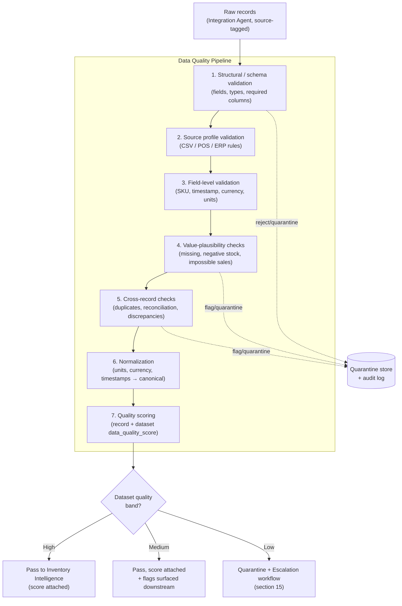
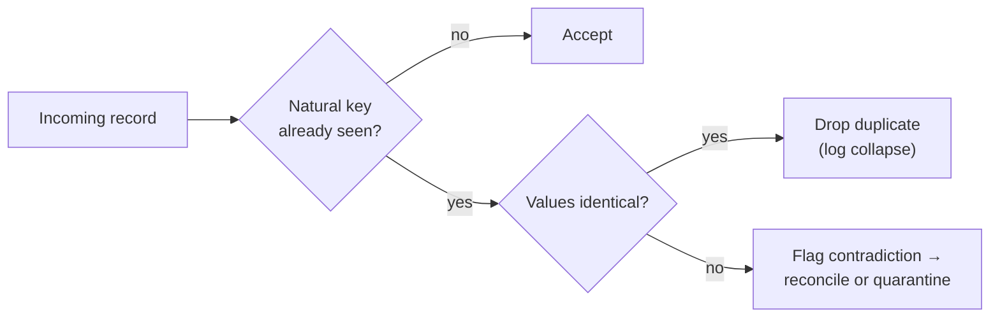

# Data Quality Policy

> **Purpose.** Define the standards, checks, scoring, and escalation that govern data
> entering StockSense, so that every downstream decision rests on trustworthy data. This
> policy operationalizes the [Data Quality Agent](../agents/agent-catalog.md#2-data-quality-agent-added-in-critical-review)
> and the data-governance commitments in [ADR-0007](../architecture/adr/0007-ai-governance-framework.md).

**Governing principle:** *garbage in must never become confident advice out.* StockSense
would rather **lower confidence, flag, or withhold** than silently clean bad data and
present it as truth. Poor data quality is always made **visible** downstream — never
hidden — consistent with the [AI Philosophy](../product/12-ai-philosophy.md) rules
"never recommend without evidence" and "graceful degradation."

This policy is the contract between the **Integration Agent** (which ingests raw data) and
the **Inventory Intelligence Agent** (which consumes validated data). It is Phase 0
documentation; no code is implied here.

---

## 1. Objectives

1. **Protect decision integrity.** Ensure forecasts, risk findings, and recommendations are
   built only on data that meets a defined quality bar.
2. **Make quality measurable and portable.** Attach a `data_quality_score` to every record
   and dataset that travels downstream on the shared message envelope
   ([Agent Architecture §5.2](../architecture/13-agent-architecture.md#52-canonical-message-envelope-conceptual)).
3. **Surface, never suppress.** Expose discrepancies (e.g., shrink, negative stock,
   impossible sales) rather than absorbing them.
4. **Fail safe.** When data cannot be trusted, degrade gracefully — lower confidence, flag,
   quarantine, or withhold — instead of guessing.
5. **Be source-aware.** Apply the right validation profile per source (CSV, POS, ERP), since
   each has different reliability and failure modes ([ADR-0006](../architecture/adr/0006-layer-over-systems-of-record.md)).
6. **Be transparent and auditable.** Every rejection, correction, and quarantine is logged
   with its reason and tied to a `trace_id` ([ADR-0007](../architecture/adr/0007-ai-governance-framework.md)).
7. **Preserve tenant isolation.** Quality processing never mixes data across retailers.

---

## 2. Data Validation Pipeline

Validation runs as a staged pipeline. Each stage can **pass**, **correct-and-annotate**,
**quarantine**, or **reject** a record, and every action is recorded. The pipeline is
deterministic and ordered so that structural problems are caught before semantic ones.



**Stage outcomes**

| Outcome | Meaning | Downstream effect |
| --- | --- | --- |
| **Pass** | Meets the bar as-is | Flows on with a quality score |
| **Correct-and-annotate** | Deterministically fixable (e.g., unit normalization) | Flows on; correction logged; may reduce score |
| **Quarantine** | Suspect; cannot be trusted but not clearly discardable | Held out of analysis; escalated; visible |
| **Reject** | Invalid/unusable (e.g., unparseable, schema-breaking) | Excluded; logged with reason |

**Non-destructive rule:** raw source data is never mutated in place. Corrections and
normalizations produce a derived, validated record while the original remains referenceable
for audit.

---

## 3. Missing Value Handling

| Field class | Policy when missing |
| --- | --- |
| **Critical keys** (SKU/product id, tenant, quantity for a stock/sales record) | Record cannot be trusted → **quarantine or reject**; never invent a key |
| **Critical numerics** (on-hand quantity, sale quantity, price where required) | Quarantine the record; do **not** impute silently |
| **Important context** (timestamp, currency, unit of measure) | Attempt source-profile inference where unambiguous (e.g., a POS with a fixed store currency); otherwise flag and reduce score |
| **Optional/enrichment** (category, supplier lead time, perishability) | Allow with a flag; feature is degraded rather than blocked; score lightly reduced |

Rules:

- **No silent imputation of decision-critical values.** Any inference is explicit, logged,
  and reflected in the quality score. The Inventory Intelligence Agent "exposes known gaps
  rather than interpolating silently."
- **Completeness is a scored dimension** (section 14), so widespread missingness lowers the
  dataset band even when individual records pass.

---

## 4. Duplicate Detection

- **Exact duplicates** (identical record emitted more than once, e.g., a re-uploaded CSV or
  a POS retransmission) are **de-duplicated**; the collapse is logged.
- **Key-collision duplicates** (same natural key — e.g., same transaction id, or same
  SKU+timestamp stock snapshot — with **conflicting** values) are **not** silently merged.
  They are flagged as contradictions and reconciled (section 5) or quarantined.
- **Near-duplicates** (same event within a tiny time window with differing ids) are flagged
  for review under the source profile's tolerance.



Idempotency: ingestion is designed to be **idempotent** on natural keys so repeated
imports do not inflate quantities or sales.

---

## 5. Invalid SKU Handling

A SKU is the primary join key across inventory, sales, and forecasting; invalid SKUs
corrupt everything downstream.

| Condition | Handling |
| --- | --- |
| **Missing SKU** on a stock/sales record | Quarantine (cannot be attributed) |
| **Malformed SKU** (fails format/charset/length rules for the source profile) | Quarantine; flag format violation |
| **Unknown SKU** (not in the product catalog) | Quarantine as "orphan"; surface for catalog reconciliation — a sale/stock for an unknown product is a real signal, not noise |
| **Ambiguous SKU** (maps to multiple catalog entries) | Flag; do not guess the mapping |
| **Deprecated/merged SKU** | Remap via an explicit, logged alias table; never infer silently |

Orphan SKUs are a common, informative failure (e.g., a new product not yet in the catalog),
so they are **quarantined and surfaced**, not discarded.

---

## 6. Negative Inventory Detection

- **Negative on-hand quantity is physically impossible** and is always flagged as a
  data-quality event (it usually signals unrecorded receipts, double-counted sales, or
  sync errors — often related to shrink discrepancies noted in
  [Business Workflow](09-business-workflow.md)).
- **Handling:** the offending record is flagged and **quarantined from state**; the
  discrepancy is **surfaced**, never clamped-to-zero-and-forgotten. The Data Quality Agent
  "surfaces discrepancies rather than absorbing them."
- **Reconciliation:** where an adjacent adjustment/receipt explains the negative, it is
  reconciled and logged; otherwise it escalates (section 15).
- **Score impact:** negative inventory materially lowers the accuracy dimension and can push
  a dataset into the Low band.

---

## 7. Impossible Sales Detection

Sales records are validated for physical and business plausibility:

| Check | Example of "impossible" / implausible |
| --- | --- |
| **Non-positive quantity** | Sale quantity of 0 or negative (unless an explicit return type) |
| **Exceeds available + replenishment** | Selling far more units than could have existed on hand |
| **Price sanity** | Negative price; price wildly outside the item's known range |
| **Rate implausibility** | Thousands of units of a slow-mover sold in one minute |
| **Future-dated sale** | Transaction timestamp in the future (section 8) |
| **Orphan sale** | Sale for an unknown SKU (section 5) |

Handling: implausible sales are **flagged and quarantined** from the demand signal so they
do not distort forecasts, then escalated for review. Genuine anomalies (a real demand
spike) are distinguished from data errors by cross-checking corroborating records; when
unclear, the record is held rather than trusted.

---

## 8. Timestamp Validation

- **Parseable & timezone-resolved:** timestamps must parse to a canonical form; ambiguous
  or missing timezones are resolved via the source profile (e.g., store-local timezone) or
  flagged.
- **Range checks:** reject/quarantine **future-dated** events and implausibly old dates
  outside the retailer's operating history.
- **Monotonicity / ordering:** stock-movement sequences that go back in time or arrive out
  of order are flagged for reconciliation.
- **Granularity:** timestamps must be precise enough for the seasonality/day-of-week
  signals the Forecast Agent relies on; date-only where time is required is flagged.
- **Canonicalization:** all timestamps are normalized to a single canonical timezone
  representation (section 10) while retaining source-local context for display.

---

## 9. Currency Validation

- **Known currency code:** every monetary value carries a valid ISO-4217 currency; missing
  currency is inferred from the source/tenant profile only when unambiguous, else flagged.
- **Single source of truth per tenant/store:** mixed currencies within a scope that should
  be single-currency are flagged as a discrepancy.
- **No blind FX conversion:** currency is **normalized for consistency**, but conversions
  (if ever needed) use explicit, dated FX rates and are logged — never guessed.
- **Precision:** monetary values respect the currency's minor-unit precision; malformed or
  over-precise values are flagged.
- **Sanity:** negative prices/costs (outside explicit refund/return semantics) are flagged
  (section 7).

---

## 10. Unit Normalization

Retail data mixes units (each, pack, case, kg, litre); un-normalized units corrupt quantity
math and forecasts.

- **Canonical unit per SKU:** each SKU has a canonical unit of measure; incoming quantities
  are converted using explicit, catalog-defined conversion factors (e.g., 1 case = 24 each).
- **Explicit factors only:** if a conversion factor is unknown, the record is **flagged**,
  not guessed.
- **Consistency checks:** quantities whose unit disagrees with the SKU's expected unit are
  flagged before conversion.
- **Lossless & logged:** normalization records both the original and canonical values so it
  is auditable and reversible.
- **Scope:** normalization also covers currency (section 9) and timestamps (section 8) into
  their canonical forms.

---

## 11. CSV Validation

CSV/spreadsheet imports are the **lowest-trust** source (hand-edited, inconsistent) and get
the strictest structural profile.

| Check | Rule |
| --- | --- |
| **Encoding & delimiter** | Detect/confirm encoding (UTF-8 preferred) and delimiter; reject unparseable files |
| **Header/schema** | Required columns present and mapped; unknown/extra columns flagged |
| **Type coercion** | Each column coerced to its expected type; failures per cell are flagged, not silently dropped |
| **Row integrity** | Ragged rows (wrong column count), embedded newlines, and stray quotes handled or quarantined |
| **Size & limits** | Enforce max file/row size to prevent resource exhaustion ([ADR-0008](../architecture/adr/0008-security-architecture.md)) |
| **Injection safety** | Treat cell content as untrusted data, never as formulas/commands ([ADR-0008](../architecture/adr/0008-security-architecture.md)) |
| **Idempotency** | Re-uploads de-duplicated on natural keys (section 4) |

CSV imports typically **start at a lower baseline quality score** and must earn a higher
band by passing checks.

---

## 12. POS Validation

POS feeds are **higher-trust, high-volume, near-real-time**, but prone to retransmissions,
partial batches, and sync gaps.

| Check | Rule |
| --- | --- |
| **Transaction integrity** | Each sale has an id, timestamp, SKU(s), quantity, and price; incomplete transactions quarantined |
| **De-duplication** | Idempotent on transaction id to absorb retransmissions (section 4) |
| **Completeness / gaps** | Detect missing batches or time gaps (a silent feed is a data-quality event, not "zero sales") |
| **Ordering / late arrivals** | Handle out-of-order and late events without corrupting sequences (section 8) |
| **Returns vs. sales** | Returns explicitly typed so they are not treated as negative-quantity errors (section 7) |
| **Reconciliation** | Sales cross-checked against stock movements to detect impossible sales / negative inventory (sections 6–7) |

A **stalled POS feed** is flagged as reduced freshness (timeliness dimension) so downstream
forecasts do not mistake absence of data for absence of demand.

---

## 13. ERP Validation

ERP sources are **structured and authoritative** but can be stale, complex, and internally
inconsistent across modules.

| Check | Rule |
| --- | --- |
| **Schema/contract conformance** | Validate against the ERP connector's expected schema/version; flag schema drift |
| **Referential integrity** | SKUs, suppliers, locations resolve to known entities; orphans flagged (section 5) |
| **Cross-module consistency** | Stock, purchasing, and sales modules reconciled; contradictions surfaced, not merged blindly |
| **Freshness / sync watermark** | Track the ERP extract's as-of time; stale extracts reduce the timeliness dimension |
| **Authority precedence** | Where ERP and POS disagree, apply a defined, logged precedence rule per field rather than silently overwriting |
| **Units & currency** | Respect ERP-configured units/currency, then normalize (sections 9–10) |

---

## 14. Quality Scoring Methodology

Every record and every dataset receives a **`data_quality_score` in `[0,1]`**, composed
from weighted quality **dimensions**. The score can only be **reduced** by problems; it is
never inflated to mask them, and it **travels downstream** so agents respect it (the
Forecast Agent lowers confidence on low-quality inputs; the Recommendation Agent may
withhold).

**Dimensions**

| Dimension | Question it answers | Example failures that lower it |
| --- | --- | --- |
| **Completeness** | Are required values present? | Missing SKU, quantity, timestamp (section 3) |
| **Validity** | Do values conform to rules/formats? | Malformed SKU, bad currency code, unparseable date |
| **Accuracy / plausibility** | Are values physically possible? | Negative inventory, impossible sales (sections 6–7) |
| **Consistency** | Do related records agree? | Duplicate conflicts, cross-module contradictions |
| **Uniqueness** | Free of unintended duplicates? | Retransmissions, re-uploaded CSVs |
| **Timeliness / freshness** | Is the data current? | Stalled POS feed, stale ERP extract |

**Score → band mapping** (aligned with the confidence bands in
[ADR-0007](../architecture/adr/0007-ai-governance-framework.md#4-confidence-thresholds-low-medium-high)):

| Band | Indicative range | Meaning | Effect on the pipeline |
| --- | --- | --- | --- |
| **High** | ≥ 0.80 | Trustworthy | Flows to analysis normally |
| **Medium** | 0.50 – 0.79 | Usable with caution | Flows on, but flags are surfaced and downstream confidence is capped/reduced |
| **Low** | < 0.50 | Not trustworthy | Quarantined from analysis; triggers the escalation workflow (section 15) |

Scoring is applied at two levels: **per-record** (drives quarantine/flag) and **per-dataset
/ per-feed** (drives the pipeline outcome and escalation). Exact dimension weights and
numeric thresholds are tuned in Phase 1 and monitored; the **dimensions and band semantics
are fixed by this policy.**

---

## 15. Escalation Workflow

When quality falls below the bar, the system escalates deterministically rather than
proceeding on bad data.

```mermaid
flowchart TB
    D["Validated batch<br/>+ dataset score"] --> B{Quality band?}
    B -- High --> OK["Proceed to analysis"]
    B -- Medium --> WARN["Proceed with flags surfaced<br/>+ reduced downstream confidence"]
    B -- Low --> Q["Quarantine affected data"]
    Q --> A{Auto-reconcilable?<br/>(explicit rule / alias / adjacent record)}
    A -- yes --> FIX["Reconcile + annotate + re-score"]
    FIX --> B
    A -- no --> NOTIFY["Notify tenant data owner<br/>(Inventory/Ops Manager)"]
    NOTIFY --> ACT{Resolved by user?}
    ACT -- yes --> REPROC["Re-ingest / re-validate"]
    REPROC --> B
    ACT -- no --> HOLD["Hold out of analysis<br/>+ mark coverage gap in summaries"]
    OK --> LOG[("Audit log")]
    WARN --> LOG
    HOLD --> LOG
    NOTIFY --> LOG
```

**Escalation principles**

- **Auto-resolve what is safely deterministic** (de-dup, unit normalization, known alias
  remap); everything else involves a human.
- **Notify the right owner:** data-quality issues route to the tenant's Inventory/Operations
  Manager via the Notification Agent, respecting signal-over-noise.
- **Coverage transparency:** unresolved quarantines appear as explicit **coverage gaps** in
  executive summaries (the Executive Agent "clearly notes coverage gaps") — the product
  never pretends missing data is healthy data.
- **Everything is logged** with `trace_id`, reason, and resolution per
  [ADR-0007](../architecture/adr/0007-ai-governance-framework.md).

---

## 16. Data Quality Agent Responsibilities

This policy is enforced by the [Data Quality Agent](../agents/agent-catalog.md#2-data-quality-agent-added-in-critical-review).
Its responsibilities under this policy:

- **Own the validation pipeline** (section 2): execute all structural, source-profile,
  field, plausibility, cross-record, and normalization checks.
- **Detect and act:** identify missing, duplicate, invalid-SKU, negative-inventory,
  impossible-sales, timestamp, currency, and unit problems and apply pass / correct /
  quarantine / reject outcomes.
- **Score:** compute per-record and per-dataset `data_quality_score` across the six
  dimensions (section 14) and attach it to the message envelope so it travels downstream.
- **Surface, never hide:** expose discrepancies (shrink, negatives, contradictions) rather
  than absorbing them.
- **Escalate:** run the escalation workflow (section 15) and route human-needed issues via
  the Notification Agent.
- **Log:** record every rejection, correction, quarantine, and reconciliation with reason
  and `trace_id` for audit.
- **Degrade gracefully:** when quality is poor, lower the score and propagate it; do **not**
  clean-and-hide.
- **Preserve isolation & non-destructiveness:** never cross tenants; never mutate raw source
  data in place.

**Boundary:** the Data Quality Agent decides *whether data is trustworthy and how much*; the
**Inventory Intelligence Agent** consumes validated data to build the truth model; the
**Forecast/Risk/Recommendation** agents *respect* the score but do not re-implement
validation.

---

## 17. Data Quality Metrics

These metrics make the policy measurable and feed the platform's
[Success Metrics](11-success-metrics.md) and governance monitoring
([ADR-0007](../architecture/adr/0007-ai-governance-framework.md)). They cannot be populated
until Phase 1; this defines *what* is measured.

| Metric | Definition | Target direction |
| --- | --- | --- |
| **Dataset quality score** | Mean `data_quality_score` per feed/tenant | ↑ / stable-high |
| **Record pass rate** | % of records passing without flag | ↑ Increase |
| **Quarantine rate** | % of records quarantined | ↓ Reduce |
| **Reject rate** | % of records rejected as unusable | ↓ Reduce |
| **Duplicate rate** | % duplicates detected/collapsed | ↓ Reduce |
| **Orphan-SKU rate** | % records with unknown SKUs | ↓ Reduce (catalog health) |
| **Negative-inventory incidents** | Count of negative-stock detections | ↓ Reduce |
| **Impossible-sales incidents** | Count of implausible sales flagged | ↓ Reduce |
| **Feed freshness / lag** | Age of newest data per source | ↓ Reduce (fresher) |
| **Feed gap incidents** | Detected missing batches / silent feeds | ↓ Reduce |
| **Escalation resolution time** | Time from quarantine to resolution | ↓ Reduce |
| **Coverage** | % of SKUs/stores with High-band data | ↑ → 100% |
| **Auto-reconciliation rate** | % of quality issues resolved without a human | ↑ Increase |

---

## 18. Examples of Acceptable and Unacceptable Datasets

Illustrative only. Values are placeholders that show the *shape* of the judgment, not real
data.

### Acceptable dataset (High band)

A daily sales export where every row is complete, consistent, and plausible:

| sku | timestamp (store-local) | qty | unit | price | currency |
| --- | --- | --- | --- | --- | --- |
| `BEV-0471` | 2026-07-05 14:32 | 3 | each | 2.50 | USD |
| `BEV-0471` | 2026-07-05 15:01 | 1 | each | 2.50 | USD |
| `SNK-1188` | 2026-07-05 15:03 | 24 | each | 0.90 | USD |

Why acceptable: SKUs exist in the catalog; timestamps parse and are in range; quantities
positive and plausible; a single currency; units match each SKU's canonical unit; no
duplicates. **Result:** passes, High `data_quality_score`, flows to analysis.

### Unacceptable / degraded dataset (with per-row disposition)

| sku | timestamp | qty | unit | price | currency | Problem → disposition |
| --- | --- | --- | --- | --- | --- | --- |
| *(blank)* | 2026-07-05 14:32 | 3 | each | 2.50 | USD | Missing SKU (§5) → **quarantine** |
| `BEV-0471` | 2026-07-05 15:01 | -8 | each | 2.50 | USD | Negative/implausible sale qty (§7) → **quarantine** |
| `BEV-0471` | 2026-07-05 15:01 | 1 | each | 2.50 | USD | Exact duplicate of a prior row (§4) → **drop (logged)** |
| `SNK-1188` | 2026-07-05 15:03 | 24 | case | 0.90 | USD | Unit mismatch, no factor (§10) → **flag** |
| `ELX-9000` | 2027-01-01 00:00 | 1 | each | 999 | USD | Future-dated timestamp (§8) → **quarantine** |
| `UNKNOWN-1` | 2026-07-05 15:05 | 2 | each | 5.00 | EUR | Orphan SKU (§5) + off-profile currency (§9) → **quarantine + flag** |
| `BEV-0471` | 2026-07-05 15:07 | 200000 | each | 2.50 | USD | Impossible sales rate (§7) → **quarantine** |

Why unacceptable as-is: multiple critical violations across completeness, accuracy,
validity, and consistency. **Result:** the batch scores in the **Low band**, offending rows
are quarantined/flagged, the valid remainder may proceed with reduced downstream confidence,
and the escalation workflow (section 15) notifies the tenant's data owner while marking the
affected SKUs/stores as coverage gaps.

### Edge case — genuine anomaly vs. data error

A sudden 5× sales spike on `BEV-0471` before a holiday weekend is **plausible** and should
*not* be discarded as an "impossible sale." The Data Quality Agent distinguishes it from an
error by corroboration (consistent timestamps, matching stock draw-down, no duplicate/ordering
anomalies). If corroborated, it passes as a real demand signal; if it stands alone and
contradicts stock movements, it is held. This is the difference between **data quality**
(this policy) and **demand anomaly detection** (the Risk Detection Agent) — the former
protects the signal so the latter can trust it.

---

## Related Documents

- [Data Quality Agent — Agent Catalog](../agents/agent-catalog.md#2-data-quality-agent-added-in-critical-review)
- [ADR-0007 — AI Governance Framework](../architecture/adr/0007-ai-governance-framework.md)
- [ADR-0006 — Layer over systems of record](../architecture/adr/0006-layer-over-systems-of-record.md)
- [ADR-0008 — Security Architecture](../architecture/adr/0008-security-architecture.md) (input validation, injection safety)
- [Agent Architecture](../architecture/13-agent-architecture.md) (message envelope, layers)
- [Business Workflow](09-business-workflow.md) · [Success Metrics](11-success-metrics.md)
